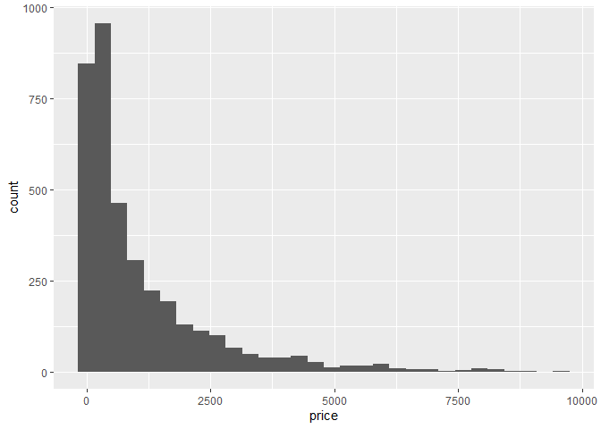
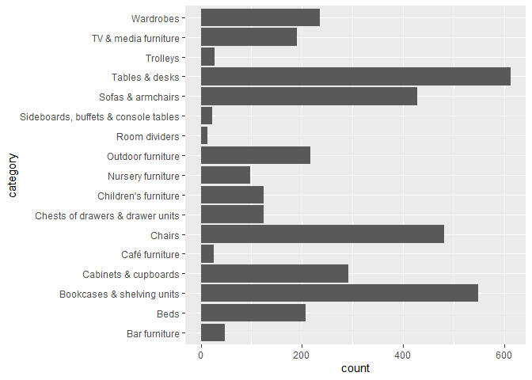
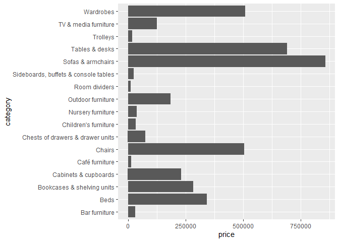
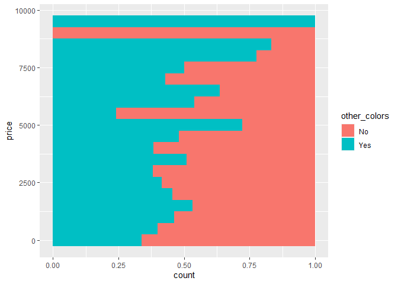
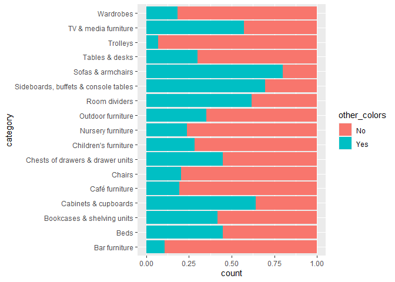

Ikea
================
Fanyi Zeng
2022-05-04

``` r
ikea <- readr::read_csv('https://raw.githubusercontent.com/rfordatascience/tidytuesday/master/data/2020/2020-11-03/ikea.csv')
```

``` r
library(tidymodels)
```

Let’s take a look at the distribution of price. The distribution is
right/positively skewed. Most items are in the lower price range.

``` r
ikea %>%
  ggplot(aes(x=price)) +
  geom_histogram()
```

    ## `stat_bin()` using `bins = 30`. Pick better value with `binwidth`.

<!-- -->

They are selling a lot of desks, chairs, and shelves.

``` r
ikea %>%
  ggplot(aes(y=category)) +
  geom_histogram(stat="count")
```

    ## Warning: Ignoring unknown parameters: binwidth, bins, pad

<!-- -->

Sofas, desks, chairs, wardrobes are the more expensive items.

``` r
ikea %>%
  ggplot(aes(x=price,y=category)) +
  geom_bar(stat="identity")
```

<!-- -->

Most items are sellable online, so there won’t be much value in
comparing the prices between online and on-site items.

``` r
ikea %>%
  count(sellable_online)
```

    ## # A tibble: 2 x 2
    ##   sellable_online     n
    ##   <lgl>           <int>
    ## 1 FALSE              28
    ## 2 TRUE             3666

On average, items that have other colors are more expensive (higher
mean, median, and mode).

``` r
ikea %>% 
  filter(other_colors=="Yes") %>%
  summary(price)
```

    ##       ...1           item_id             name             category        
    ##  Min.   :   3.0   Min.   :  141689   Length:1512        Length:1512       
    ##  1st Qu.: 882.8   1st Qu.:20334220   Class :character   Class :character  
    ##  Median :2016.5   Median :49133616   Mode  :character   Mode  :character  
    ##  Mean   :1799.9   Mean   :47473532                                        
    ##  3rd Qu.:2561.2   3rd Qu.:70299879                                        
    ##  Max.   :3685.0   Max.   :99930961                                        
    ##                                                                           
    ##      price         old_price         sellable_online     link          
    ##  Min.   :   3.0   Length:1512        Mode :logical   Length:1512       
    ##  1st Qu.: 245.0   Class :character   FALSE:5         Class :character  
    ##  Median : 672.5   Mode  :character   TRUE :1507      Mode  :character  
    ##  Mean   :1215.1                                                        
    ##  3rd Qu.:1595.2                                                        
    ##  Max.   :9585.0                                                        
    ##                                                                        
    ##  other_colors       short_description    designer             depth       
    ##  Length:1512        Length:1512        Length:1512        Min.   :  6.00  
    ##  Class :character   Class :character   Class :character   1st Qu.: 37.25  
    ##  Mode  :character   Mode  :character   Mode  :character   Median : 47.00  
    ##                                                           Mean   : 59.74  
    ##                                                           3rd Qu.: 80.00  
    ##                                                           Max.   :257.00  
    ##                                                           NA's   :478     
    ##      height           width      
    ##  Min.   :  2.00   Min.   :  2.0  
    ##  1st Qu.: 69.75   1st Qu.: 60.0  
    ##  Median : 84.00   Median : 90.0  
    ##  Mean   :102.46   Mean   :119.8  
    ##  3rd Qu.:125.00   3rd Qu.:160.0  
    ##  Max.   :240.00   Max.   :387.0  
    ##  NA's   :372      NA's   :224

``` r
ikea %>% 
  filter(other_colors=="No") %>%
  summary(price)
```

    ##       ...1         item_id             name             category        
    ##  Min.   :   0   Min.   :   58487   Length:2182        Length:2182       
    ##  1st Qu.:1010   1st Qu.:20423880   Class :character   Class :character  
    ##  Median :1776   Median :50206857   Mode  :character   Mode  :character  
    ##  Mean   :1879   Mean   :49435423                                        
    ##  3rd Qu.:2918   3rd Qu.:70451635                                        
    ##  Max.   :3693   Max.   :99932615                                        
    ##                                                                         
    ##      price         old_price         sellable_online     link          
    ##  Min.   :   5.0   Length:2182        Mode :logical   Length:2182       
    ##  1st Qu.: 150.0   Class :character   FALSE:23        Class :character  
    ##  Median : 450.0   Mode  :character   TRUE :2159      Mode  :character  
    ##  Mean   : 983.3                                                        
    ##  3rd Qu.:1266.0                                                        
    ##  Max.   :8900.0                                                        
    ##                                                                        
    ##  other_colors       short_description    designer             depth       
    ##  Length:2182        Length:2182        Length:2182        Min.   :  1.00  
    ##  Class :character   Class :character   Class :character   1st Qu.: 38.00  
    ##  Mode  :character   Mode  :character   Mode  :character   Median : 47.00  
    ##                                                           Mean   : 49.75  
    ##                                                           3rd Qu.: 56.00  
    ##                                                           Max.   :252.00  
    ##                                                           NA's   :985     
    ##      height           width       
    ##  Min.   :  1.00   Min.   :  1.00  
    ##  1st Qu.: 65.25   1st Qu.: 53.00  
    ##  Median : 78.00   Median : 78.00  
    ##  Mean   :101.11   Mean   : 93.61  
    ##  3rd Qu.:124.00   3rd Qu.:100.00  
    ##  Max.   :700.00   Max.   :420.00  
    ##  NA's   :616      NA's   :365

Indeed, there seems to be a positive, significant relationship between
item price and whether it has other colors.

``` r
m <- lm(price ~ other_colors, ikea)
summary(m)
```

    ## 
    ## Call:
    ## lm(formula = price ~ other_colors, data = ikea)
    ## 
    ## Residuals:
    ##     Min      1Q  Median      3Q     Max 
    ## -1212.1  -865.1  -534.7   331.2  8369.9 
    ## 
    ## Coefficients:
    ##                 Estimate Std. Error t value Pr(>|t|)    
    ## (Intercept)       983.34      29.33  33.526  < 2e-16 ***
    ## other_colorsYes   231.79      45.85   5.056 4.49e-07 ***
    ## ---
    ## Signif. codes:  0 '***' 0.001 '**' 0.01 '*' 0.05 '.' 0.1 ' ' 1
    ## 
    ## Residual standard error: 1370 on 3692 degrees of freedom
    ## Multiple R-squared:  0.006876,   Adjusted R-squared:  0.006607 
    ## F-statistic: 25.56 on 1 and 3692 DF,  p-value: 4.494e-07

In the lower price range, more items don’t have colors. In the higher
price range, more items have colors.

``` r
ikea %>%
  ggplot(aes(y=price,fill=other_colors)) +
  geom_histogram(binwidth=500,position="fill")
```

<!-- -->

Most colorful items: sofas, cabinets, room dividers, TV & media
furniture. Least colorful items: trolleys, bar furniture, wardrobes.

``` r
ikea %>%
  ggplot(aes(y=category,fill=other_colors)) +
  geom_histogram(stat="count",position="fill")
```

    ## Warning: Ignoring unknown parameters: binwidth, bins, pad

<!-- -->

Next time I shop at Ikea, I know where to look for those colorful items!
